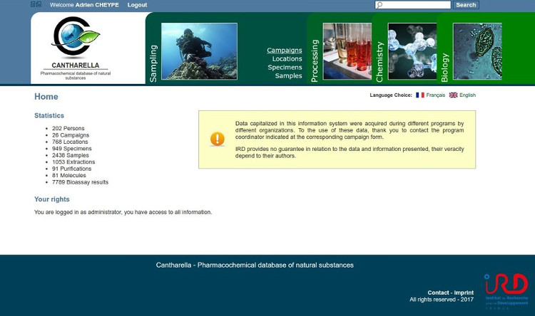
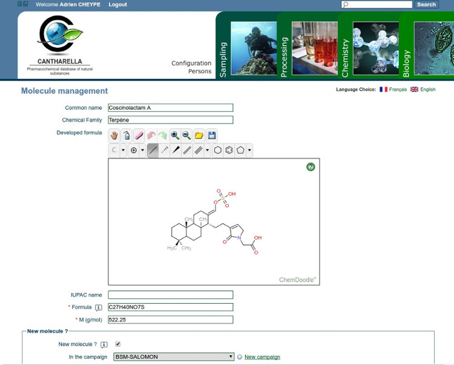

# Cantharella

*The GitHub repository in only a mirror of [the one hosted by Code Lutin](https://forge.codelutin.com/projects/cantharella).*

The information system (IS) Cantharella: Pharmacochemical database of natural substances, designed and developed by 
[IRD](http://www.ird.fr), share and sustain pharmacochemical data of all organisms collected for the study of their
natural substances, with a controlled access via internet.
The IS provides access to harvest and taxonomic data, monitor various chemical processes of extraction and 
purification, and finally centralize all biological activities. The database is progressive according to the extraction
and purification methods needed and the biological tests performed.

Cantharella is an open source information system based on Java components and a PostgreSQL database.

**News from 2017-08:**The application have been dockerized. See [Deployment with Docker](#deployment-with-docker)
section.

More info on the project, [here](src/site/rst/index.rst).





### License

Cantharella is distributed under the terms of the under the terms of the GNU General Public License, version 3.0. The 
text is included in the file LICENSE in the root of the project.

### Java and database servers requirements

Cantharella requires at least Java 1.6. The application server for running your web application should adhere to the 
servlet specification version 2.5 or newer. Tomcat 6 or newer is recommended.
For the database, the IS requires a PostgreSQL database (version 8.0 or newer).

### Dependencies

Cantharella is dependent to some librairies from another open source projects. This is the list of the dependencies and
their licenses.
  - [Apache Commons](http://commons.apache.org), under the Apache License 2.0
  - [JUnit](www.junit.org), under the Common Public License 1.0
  - [ICU4J](http://www.icu-project.org), under the ICU License (compatible with GNU GPL)
  - [Log4j](http://logging.apache.org/log4j), under the Apache License 2.0
  - [SFL4J](http://www.slf4j.org), under the MIT license
  - [AspectJ](http://www.eclipse.org/aspectj), under the Common Public License 1.0
  - [Spring](http://www.springsource.org), under the Apache License 2.0
  - [Javassist](http://www.jboss.org/javassist), under the GNU Lesser General Public License 2.1
  - [Cglib](http://cglib.sourceforge.net), under the Apache License 1.1
  - [Hibernate](http://www.hibernate.org), under the GNU Lesser General Public License 2.1
  - [POI](http://poi.apache.org), under the Apache License 2.0
  - [Wicket](http://wicket.apache.org), under the Apache License 2.0
  - [PostgreSQL JDBC Driver](http://jdbc.postgresql.org), under the BSD License (same as the SGBD)
  - [ChemDoodle Web Components](http://web.chemdoodle.com), under GNU General Public License, version 3.0

You can refer to the licenses folder of the project to see each license conditions.
The dependency libraries are managed by the the Maven build tool (http://maven.apache.org). The Maven's dependency 
mechanism will download all the necessary libraries automatically. You can see the dependencies declared in the 
pom.xml files to known each library version.

## Deployment with Docker

*You can find the detailled instruction for a classic installation [here](src/site/rst/installation.rst).*

### Requirement

Please first install Docker CE (Community Edition) and Docker Compose by following the official instructions :
 - https://docs.docker.com/engine/installation/
 - https://docs.docker.com/compose/install/

### In dev environment

#### Building

First, from the project root, construct the war from the project sources with mvn :

    mvn clean package

Then copy this war and the sql scripts (if needed, replace the version number) :

    cp cantharella.web/target/cantharella-1.2.2.war docker/dev/cantharella-web/cantharella.war
    cp -R sql docker/dev/cantharella-db/docker-entrypoint-initdb.d

Then build the project images (`cantharella-db` and `cantharella-web` at the same time)

    cd docker/dev
    docker-compose build

#### Starting the application

Go into the `docker/dev` directory and launch the application with the docker-compose command :

    docker-compose up

Then, you can verify the status of the two containers (`cantharella-db` and `cantharella-web`) :

    docker ps

To stop properly the application (with the delete of the containers), execute this command :

    docker-compose down

### In production environment

#### Starting the application

In the production environment, the compose configuration file is in the `docker/prod` directory.

Only this file is needed to start the application, the two containers, `cantharella.db` and `cantharella.web`, are
created from the version-tagged image downloaded from the Docker Hub.

First next to the `docker-compose-prod.yml`, create two config files needed to define your passwords. The first one
`cantharella-db.env` must have this content :

    POSTGRES_PASSWORD=thePasswordForTheAdminCountOfTheDB
    CANTHARELLA_PASSWORD=thePasswordOfTheCantharellaUser

And the second one `cantharella-web.env` has this one :

    DB.PASSWORD=thePasswordOfTheCantharellaUserUsedConnectingTheWebAppToTheDB

In the latter, you can also define other variables of the web application configuration file (see the documentation
file `/src/site/rst/configuration.rst` for more details).

When the configuration file are set, you can launch the application with the docker-compose command :

    docker-compose up

As with the dev environment, you can verify the status of the containers with `docker ps` and stop properly the
application with `docker-compose down`.

The database data will be stored in the directory `/data/postgres`. If this location refer to an existing postgres
data directory, the application expects that a cantharella database already exists. However, the container will
create a new postgres directory and init an empty cantharella database.

If needed, it's possible to modify the postgres data directory location by changing in the `docker-compose.yml` the
part before `:` in that section :

```
volumes:
    - /data/postgresql:/var/lib/postgresql/data
```

#### Autostart using Systemd

For linux system which rely on systemd, the followed configuration will automatically execute a Cantharella service
at system startup.

First create the service file and add the followed content with `vi /etc/systemd/system/cantharella.service` :

```
[Unit]
Description=cantharella
Requires=docker.service
After=docker.service

[Service]
User=root
ExecStartPre=-/usr/local/bin/docker-compose -f /data/cantharella.git/docker/docker-compose-prod.yml down
ExecStart=/usr/local/bin/docker-compose -f /data/cantharella.git/docker/docker-compose-prod.yml up
ExecStop=/usr/local/bin/docker-compose -f /data/cantharella.git/docker/docker-compose-prod.yml stop

[Install]
WantedBy=multi-user.target
```
(adapt the path for the `docker-compose.yml` according to your situation)

Then enable the start at startup :

    systemctl enable cantharella