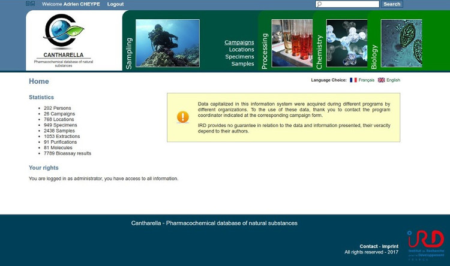
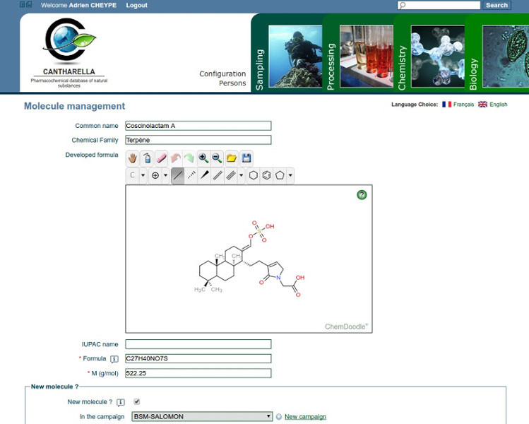

.. -
.. * #%L
.. * Cantharella
.. * $Id: index.rst 278 2017-08-03 03:12:39Z acheype $
.. * $HeadURL: https://svn.codelutin.com/cantharella/trunk/src/site/rst/index.rst $
.. * %%
.. * Copyright (C) 2009 - 2012 IRD (Institut de Recherche pour le Developpement) and by respective authors (see below)
.. * %%
.. * This program is free software: you can redistribute it and/or modify
.. * it under the terms of the GNU Affero General Public License as published by
.. * the Free Software Foundation, either version 3 of the License, or
.. * (at your option) any later version.
.. * 
.. * This program is distributed in the hope that it will be useful,
.. * but WITHOUT ANY WARRANTY; without even the implied warranty of
.. * MERCHANTABILITY or FITNESS FOR A PARTICULAR PURPOSE.  See the
.. * GNU General Public License for more details.
.. * 
.. * You should have received a copy of the GNU Affero General Public License
.. * along with this program.  If not, see <http://www.gnu.org/licenses/>.
.. * #L%
.. -

Description
-----------

The information system (IS) **Cantharella: Pharmacochemical database of natural substances**, 
designed and developed by IRD, share and sustain pharmacochemical data of all organisms collected 
for the study of their natural substances, with a controlled access via the Internet.

The IS provides access to **harvest and taxonomic data**, monitor various chemical processes of 
extraction and purification, and finally centralize all **biological activities**.
The database is progressive according to the extraction and purification methods needed and the 
biological tests performed.

Features
--------

- **Collaborative** work between spatially disparate people
- **Secure access** and 'compartmentalized' according to data access rights
- **Traceability** of the chemical process leading to the active compounds
- **Capitalization** of data and related documents

Screenshots
-----------

Home

.. figure:: ../resources/images/Station.jpg

Location form

Extraction form

Molecule form

   

